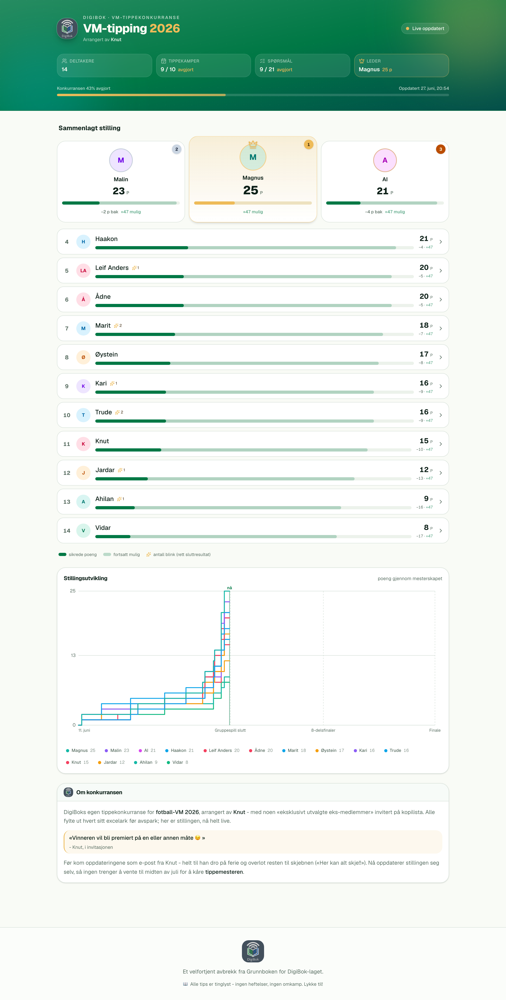
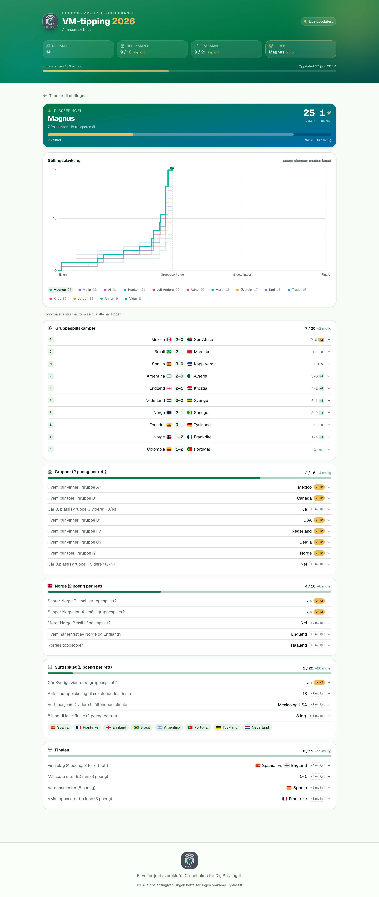
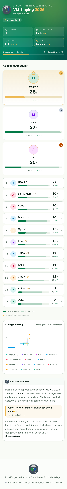

# VM-tipping 2026 · DigiBok

Live stilling i DigiBoks tippekonkurranse for fotball-VM 2026 – arrangert av Knut.
Alle fylte ut hvert sitt excelark før avspark; appen henter resultater fra
[football-data.org](https://www.football-data.org), regner ut poeng for hver deltaker
og viser stillingen, detaljerte fasit-oppgjør og hvordan stillingen har utviklet seg
gjennom mesterskapet – helt automatisk.

Bygget med [Next.js](https://nextjs.org) (App Router), React 19, Tailwind v4 og
Drizzle ORM mot Postgres.

<picture>
  <source media="(prefers-color-scheme: dark)" srcset="docs/screenshots/standings-dark.png">
  
</picture>

## Funksjoner

- **Sammenlagt stilling** med podium for topp 3, og for hver deltaker en stolpe som
  skiller _sikrede_ poeng fra poeng som fortsatt er _mulige_ – pluss «blink» (antall
  helt riktige sluttresultat).
- **Detaljvisning per deltaker** med alle 10 gruppekamper og bonusrundene (grupper,
  Norge, sluttspill, finale): hva som ble tippet, fasiten, og poengene linje for linje.
- **Stillingsutvikling** – en graf som viser poengene til alle deltakere gjennom hele
  mesterskapet, med milepæler for gruppespill, åttedelsfinaler og finale.
- **Live resultater** fra football-data.org, mellomlagret i Postgres. API-et kalles bare
  når en kamp faktisk har startet siden forrige henting (og tidligst hvert ~5. minutt) –
  ferdigspilte resultater hentes aldri på nytt, og når finalen er spilt fryses
  snapshotet helt.
- **Automatisk fasit**: svarnøkkelen utledes fra VM-dataene (tabeller, toppscorere,
  kampresultater) og kan overstyres manuelt via `lib/data/fasit.json`.
- **Lys/mørk modus** og responsivt design (egen mobillayout).
- **Delbar deltakervisning**: hvem som er åpen ligger i URL-en (`?deltaker=Navn`), så
  fram/tilbake i nettleseren fungerer og en spillervisning kan bokmerkes.

| Detaljvisning per deltaker | Mobil |
| --- | --- |
|  |  |

## Kom i gang

### 1. Miljøvariabler

Hent et API-nøkkel fra [football-data.org](https://www.football-data.org/client/register) og kopier miljøfila:

```bash
cp .env.template .env
# fyll inn FOOTBALL_DATA_API_KEY i .env
```

`DATABASE_URL` er allerede satt til å peke på den lokale Postgres-databasen under.

### 2. Database (Postgres via Docker)

Resultatene mellomlagres i Postgres slik at football-data.org-API-et bare kalles når dataene er eldre enn ~5 minutter – ikke på hvert sidevisning.

```bash
npm run db:up      # starter Postgres (docker compose, port 5432)
npm run db:push    # oppretter tabellen (drizzle-kit)
```

Nyttig:

```bash
npm run db:studio  # nettleser-UI for å se på dataene
npm run db:down    # stopper databasen (dataene beholdes i volumet)
```

> Bruker du en egen Postgres (f.eks. Homebrew `postgresql@18`) i stedet for Docker, hopp over `db:up` og pek `DATABASE_URL` mot den. Kjør fortsatt `npm run db:push`.

### 3. Kjør appen

```bash
npm run dev
```

Åpne [http://localhost:3000](http://localhost:3000).

Første sidevisning henter fra API-et og fyller cachen; påfølgende visninger leses fra Postgres til cachen blir foreldet. Uten et API-nøkkel kjører appen fortsatt og viser «Venter på resultater». Er databasen utilgjengelig, faller appen tilbake til å kalle API-et direkte.

## Hvordan det henger sammen

Hele datasettet hentes én gang per oppdateringsvindu og lagres rått i én Postgres-rad.
Alt appen viser – kampresultater, fasit og tidslinjen til grafen – utledes fra dette
snapshotet i minnet. Når finalen er spilt fryses snapshotet og serveres fra Postgres
for alltid, uten flere API-kall.

```
football-data.org
   │  (kun når en kamp er i gang eller nyspilt; tidligst hvert 5. min; fryses etter finalen)
   ▼
Postgres · api_cache (én rad: matches + standings + scorers som JSON)
   │
   ▼  utledes i minnet
resultater · fasit (svarnøkkel) · decision-times
   │
   ▼  scoring.ts
stilling + detaljer + stillingsutvikling  ──▶  siden
```

- `lib/wc-api.ts` – eneste inngang til football-data.org. Memoisert per request
  (React `cache`) og persistert i Postgres; faller tilbake til siste gode snapshot om
  API-et feiler, og til direkte fetch om databasen er nede.
- `lib/db/schema.ts` – Drizzle-skjema for `api_cache` (én rad med rå API-JSON).
- `lib/results.ts` – mapper WC-snapshotet ned på de 10 sporede kampene.
- `lib/fasit.ts` + `lib/fasit-derive.ts` – utleder fasiten fra VM-dataene;
  `lib/data/fasit.json` overstyrer manuelt der det trengs.
- `lib/scoring.ts` – poengreglene fra excelarket (1 p for riktig tegn, 1 p for riktig
  siffer per kamp; bonuspoeng per runde).
- `lib/history.ts` + `lib/timeline.ts` – bygger stillingsutviklingen og tidfester hver
  avgjort post til kampen som faktisk avgjorde den.
- `lib/match-time.ts` – utleder kampfase (kommende/live/venter/ferdig) fra kampstart og status.
- `lib/teams.ts` – norsk↔engelsk lagnavn + ISO-koder for flagg.
- `lib/data/predictions.json` – deltakerne og tippingene deres (eksportert fra
  `akkumulert.canada.usa.mexico.xlsx`).

## Tester

```bash
npm test           # enhetstester for fasit-utledning og kamptid (node --test via tsx)
```

## Deploy

Appen kjører på Vercel. `vercel.json` overstyrer build-kommandoen til `next build`.
Sett `FOOTBALL_DATA_API_KEY` og `DATABASE_URL` (f.eks. Vercel Postgres eller Neon) som
miljøvariabler i prosjektet.

> **Skjemaendringer må pushes manuelt.** Vercel-bygget kjører kun `next build` – det
> kjører *aldri* `db:push`. Etter hver endring i `lib/db/schema.ts` må du derfor kjøre
> migreringen mot produksjonsdatabasen selv:
>
> ```bash
> DATABASE_URL="<prod-url>" npm run db:push
> ```
>
> Merk at `drizzle-kit push` kun legger til / endrer tabeller – tabeller du har *fjernet*
> fra skjemaet blir liggende igjen og må droppes manuelt i databasen. Gjør du ikke dette,
> kjører appen videre på et utdatert skjema (koden forventer `api_cache`, men prod kan
> mangle den) og faller tilbake til å kalle API-et på hvert sidevisning.

## Lær mer

- [Next.js-dokumentasjon](https://nextjs.org/docs)
- [Drizzle ORM](https://orm.drizzle.team/docs/overview)
- [football-data.org API](https://www.football-data.org/documentation/quickstart)
